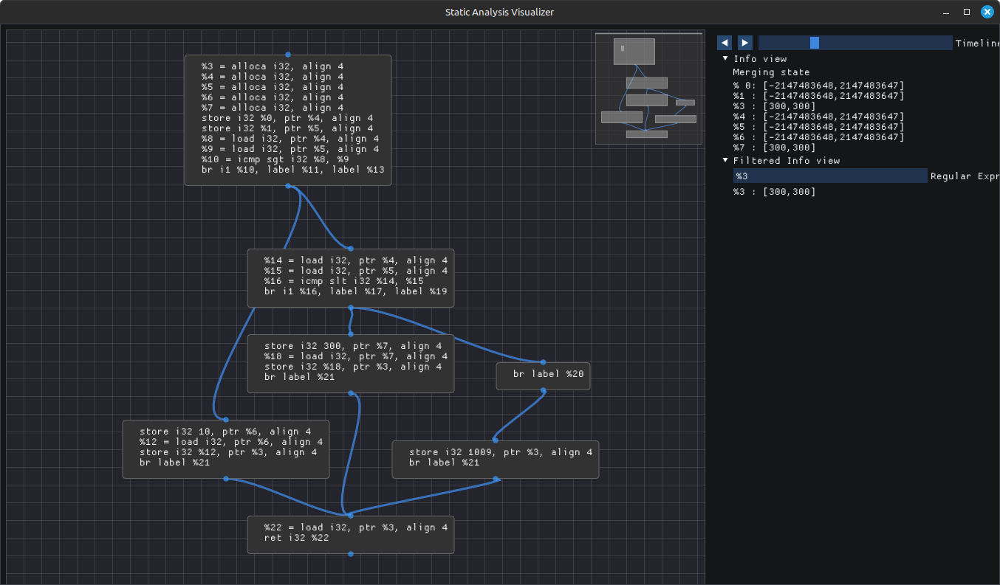

# Static Analysis Viewer



- A visualization and debugging tool for Static analysis, that can display the analysed code as a sequence of events on a Graph, allowing us to view the intermediate results of the analysis. The viewer uses a simple format to specify the graph and sequence of events, that is agnostic to the programming language, the analysis framework or the Intermediate Representation used.
- Usage: Generate the trace file from your static analysis by printing at the relevant locations in the analysis. Then load the trace file and view it in the viewer.
- Example trace files can be found in [examples](./examples) directory.
- The repository also contains helper libraires that provides loggers to print data into the tracefile (in the viewer format).
    - [DfLogger](./DfLogger) : Logger for Java programming language
    - [CPP_logger](./CPP_logger/TraceWriter.hpp) : Header only library in C++ for LLVM (version 20)
    - [Python_Logger](./Python_Logger) : Logger for Python programming language
- Built by Team Debug4 : Abdun Nihaal, Omkar Dhawal, Divya Rathore and Anubhab for [Segfault Compiler Hackathon](https://segfault.compilertech.org).
- Built using awesome open source libraries : [IMGui](https://github.com/ocornut/imgui), [IMNodes](https://github.com/nelarius/imnodes) and [GraphViz](https://graphviz.org).

## Building the viewer
```sh
# Pull libraries
git submodule update --init

# Install Dependencies
# On Linux
apt-get install libsdl2-dev libopengl-dev libgraphviz-dev
# On Mac
brew install sdl2

#To install graphviz on Mac 
brew install graphviz

#To verify the installation of graphviz use
dot -V

# Build
cd src
make
```

## Using the viewer
- Generate the tracefile in the [viewer format](#tracefile-format)
- Run the viewer with the tracefile as command-line argument
    ```
    ./sail_viewer <tracefile>
    ```
- The viewer has two panes:
    1. *Graph View* : On the left, the graph of the current group is displayed. The mini map that shows the zoomed out structure of the graph can be used for scrolling in the graph view.
    2. *Info view* : On the right, the information associated with the events are displayed in the Info view dropdown. The timeline on the top, shows the current position in the sequence of events. The arrow buttons as well as the timeline, can be used to move across events.
- The *Filtered Info View* can be used to filter and display only the relevant information, by specifying a regular expression. Only the lines in the information that match the regular expression will be displayed in the filtered info view.
- **Keyboard shortcuts**
    - Left arrow (or h) can be used to move to the previous event.
    - Right arrow (or l) can be used to move to the next event.
    - Up arrow (or k) can be used to move to the next event at the same node or edge as the current event.
    - Down arrow (or j) can be used to move to the previous event at the same node or edge as the current event.
- **Hovering** : In the graph view, when we hover the mouse on a node or edge, the information of the last event at that node or edge is displayed in the Info and Filtered Info views.

## Tracefile Format

The tracefile rendered by the viewer has to be in the following format. The tracefile consists of a series of instructions. Every instruction starts with a keyword beginning with a `>>` symbol at the beginning of a line. If the instruction takes a multi-line input argument then it will be delimited by the next instruction.

1. *Graph definition*: `>>node` and `>>edge` instructions are used to specify the nodes and edges of the graph to be viewed. Each node in the graph needs to be given a unique name or ID. Optionally, we can specify a group for the nodes to a certain portion of the graph at a time. For instance, in Inter-procedural analysis, the group names could be function names. The viewer would then render one function at a time.

    - To create a Graph node
        ```
        >>node [<groupname>:]<uniquenodeid>
        Data to be viewed in the node (eg: instructions)
        Can be multiple lines, Terminated by the next command in logfile
        ```

    - To create a Graph edge
        ```
        >>edge [<groupname>:]<srcnodeid> [<groupname>:]<dstnodeid>
        ```

2. *Sequence of Events*: The tracefile consists of a sequence of events that are logged. Each event would have some information (or Data flow facts), which can be associated with a node, or an edge, or can represent global information. The information of each event is a string (which can be multi-line). In addition to the information, we can also add an optional tag or comment that will be displayed in the viewer when the event is shown.

    - To create an event at a node:
        ```
        >>nodeinfo  [<groupname>:]<uniquenodeid> [<additional title or tag>]
        Data to be viewed in the node (eg: instructions)
        Can be multiple lines, Terminated by the next command in logfile
        ```
    - To create an event at an edge:
        ```
        >>edgeinfo [<groupname>:]<srcnodeid> [<groupname>:]<dstnodeid>  [<additional title or tag>]
        Data to be viewed in the node (eg: instructions)
        Can be multiple lines, Terminated by the next command in logfile
        ```
    - To create an event that is not associated with a node or edge:
        ```
        >>globalinfo [<additional title or tag>]
        Data to be viewed in the node (eg: instructions)
        Can be multiple lines, Terminated by the next command in logfile
        ```

3. *Optimizations to reduce tracefile size*: In order to prevent repeatedly printing the same information at different points in time, we have the `>>prev*info` instructions which would render the information present in a previous event that occurred at the same location (either node or edge or globally), and is of the same type. We can specify a different tag, if needed.
    ```
    >>prevnodeinfo  [<groupname>:]<uniquenodeid>  [<additional title or tag>]
    >>prevedgeinfo [<groupname>:]<srcnodeid> [<groupname>:]<dstnodeid>  [<additional title or tag>]
    >>prevglobalinfo [<additional title or tag>]
    ```
